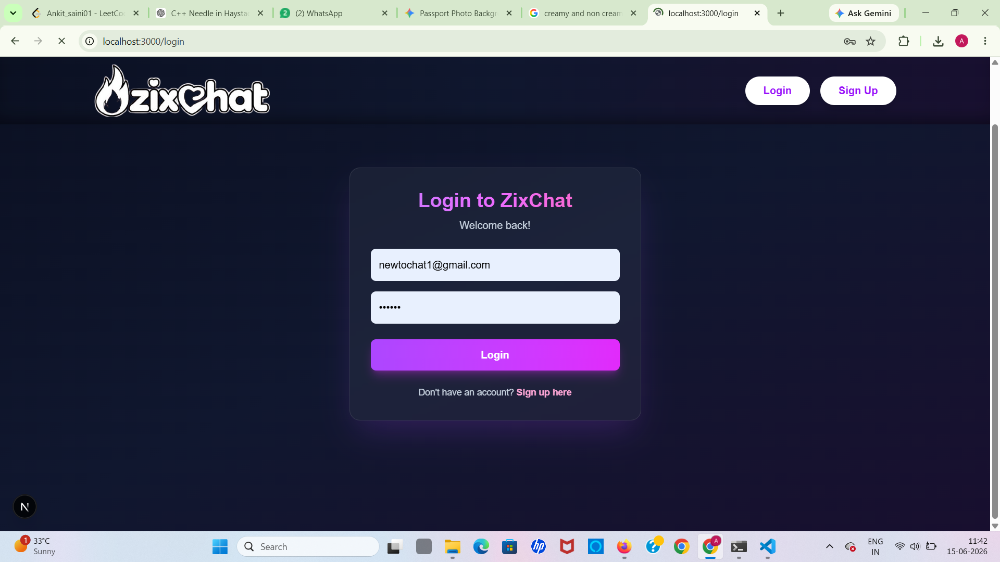
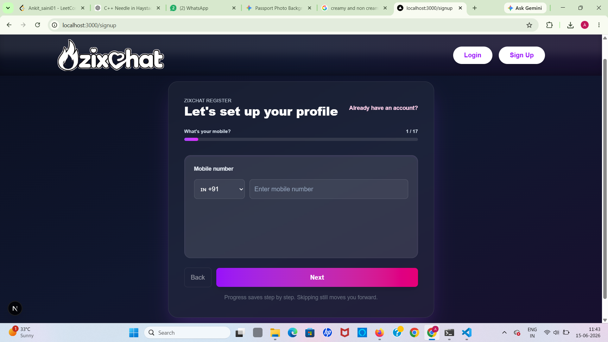
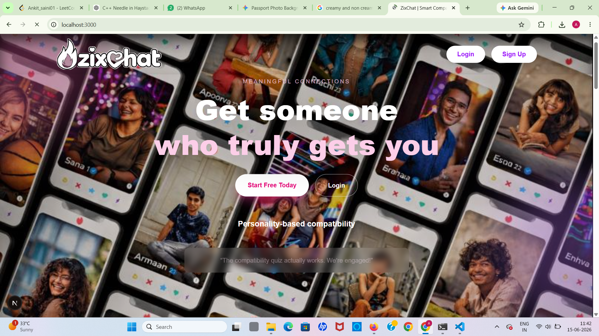
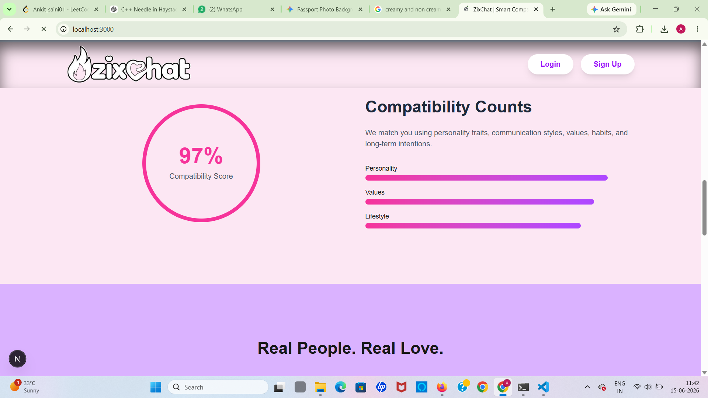

# 💬 ZixChat

ZixChat is a modern real-time chatting platform built with the MERN Stack and TypeScript. The platform helps users discover and connect with nearby people, send chat requests, and start conversations once requests are accepted. It also includes AI-powered features to enhance the chatting experience.

## 🚀 Features

### 👤 User Authentication

* Secure user registration and login
* JWT-based authentication
* Password encryption using bcrypt

### 📍 Nearby User Discovery

* Automatically find up to 10 nearby users
* Location-based user recommendations
* Dynamic user matching

### 🤝 Chat Request System

* Send chat requests to nearby users
* Accept or reject incoming requests
* Chat access only after mutual acceptance

### 💬 Real-Time Messaging

* Instant one-to-one messaging
* Real-time message delivery using Socket.IO
* Online/offline user status
* Message synchronization

### 🤖 AI Integration

* AI-powered assistance and conversation support
* Smart user engagement features
* Enhanced chat experience

### 🔒 Security

* Protected API routes
* Secure authentication flow
* Data validation and sanitization

## 🛠️ Tech Stack

### Frontend

* React.js
* TypeScript
* Tailwind CSS
* Axios
* React Router

### Backend

* Node.js
* Express.js
* TypeScript
* Socket.IO
* JWT Authentication
* Bcrypt

### Database

* MongoDB
* Mongoose

## 📂 Project Structure

```bash
ZixChat/
├── client/
│   ├── src/
│   ├── components/
│   ├── pages/
│   ├── services/
│   └── hooks/
│
├── server/
│   ├── controllers/
│   ├── routes/
│   ├── models/
│   ├── middleware/
│   ├── sockets/
│   └── utils/
│
└── README.md
```

## ⚙️ Installation

### Clone Repository

```bash
git clone https://github.com/yourusername/zixchat.git
cd zixchat
```

### Backend Setup

```bash
cd server
npm install
```

Create a `.env` file:

```env
PORT=5000
MONGODB_URI=your_mongodb_connection_string
JWT_SECRET=your_jwt_secret
CLIENT_URL=http://localhost:5173
```

Start Backend:

```bash
npm run dev
```

### Frontend Setup

```bash
cd client
npm install
npm run dev
```
### Screenshots
### login


### Signup


### home 


### Graph

## 🔄 Application Flow

1. User registers or logs in.
2. System finds up to 10 nearby users.
3. User sends a chat request.
4. Recipient accepts the request.
5. Real-time chat becomes available.
6. Users can exchange messages instantly.
7. AI features assist and enhance conversations.

## 🎯 Future Enhancements

* Voice Calling
* Video Calling
* Group Chats
* AI Match Suggestions
* Message Reactions
* Media Sharing
* Push Notifications
* End-to-End Encryption


## 🤝 Contributing

Contributions are welcome. Feel free to fork the repository and submit pull requests.

## 📄 License

This project is licensed under the MIT License.

## 👨‍💻 Developer

Developed with ❤️ using MERN Stack and TypeScript.

**ZixChat — Connect, Chat, and Discover Nearby People Instantly.**
